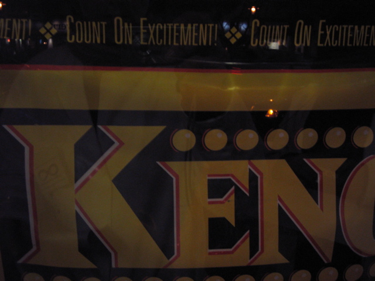

COUNT ON EXCITEMENT  
Corporation: Massachusetts State Lottery Commission  
Product: Keno  
Location: Central Sq., Cambridge, MA  
Collected On: 02-20-2005  
Researcher: The Institute for Infinitely Small Things -- Expedition #1  
Language: English
 
*Please suggest how one might go about performing this command as literally as possible.*

1. Place bets on all greyhounds and horses named excitement.
2. get a calculator, put a sticker on it that says "excitement"
3. Count out loud (eyes shut or not, depending on desired effect) as far as you can while seated on carpet that reads "excitement"
4. Find or create a drug called 'Excitement'. Ingest it and procede to count.
5. Climb on top of your 1989 Pontiac Grand Am, take a tally of something.

