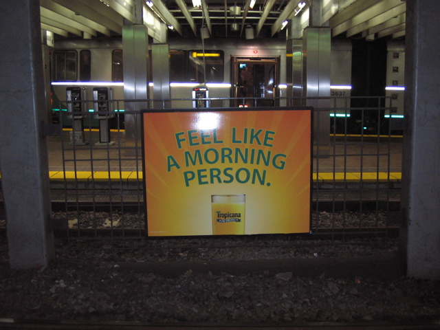

FEEL LIKE A MORNING PERSON  
Corporation: Tropicana  
Product: orange juice  
Location: Park Street Station, Boston, MA  
Collected On: 02-15-2005  
Researcher: kanarinka  
Language: English
 
*Please suggest how one might go about performing this command as literally as possible.*

1. don't eat before bed, go to sleep earlier, turn off the alarm clock
2. bathe in orange juice while singing O What a Glorious Morning
3. Experience the death of a loved one. Later, check on spelling.

