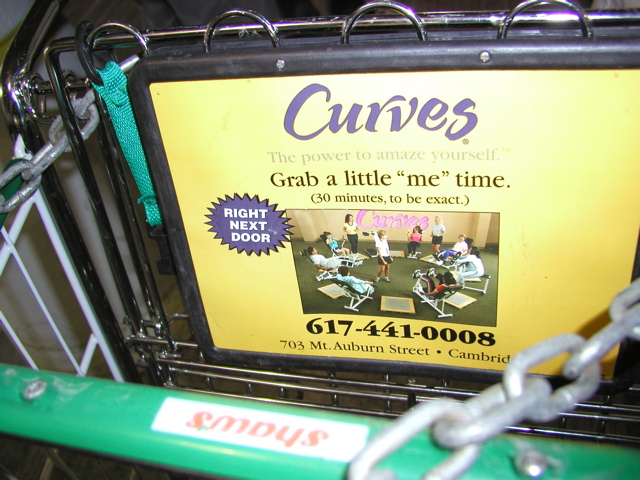

Grab a little "me" time  
Corporation: Curves International  
Product: Curves gyms  
Location: Star Market parking lot, Cambridge, MA     
Collected On: 03-09-2005  
Researcher: The Institute for Infinitely Small Things -- Expedition: Rollover  
Language: English
 
*Please suggest how one might go about performing this command as literally as possible.*

1. you know...
2. forcefully take a watch from your child, or someone smaller who looks like you
3. pretend you are short and wear something with a watch on it

