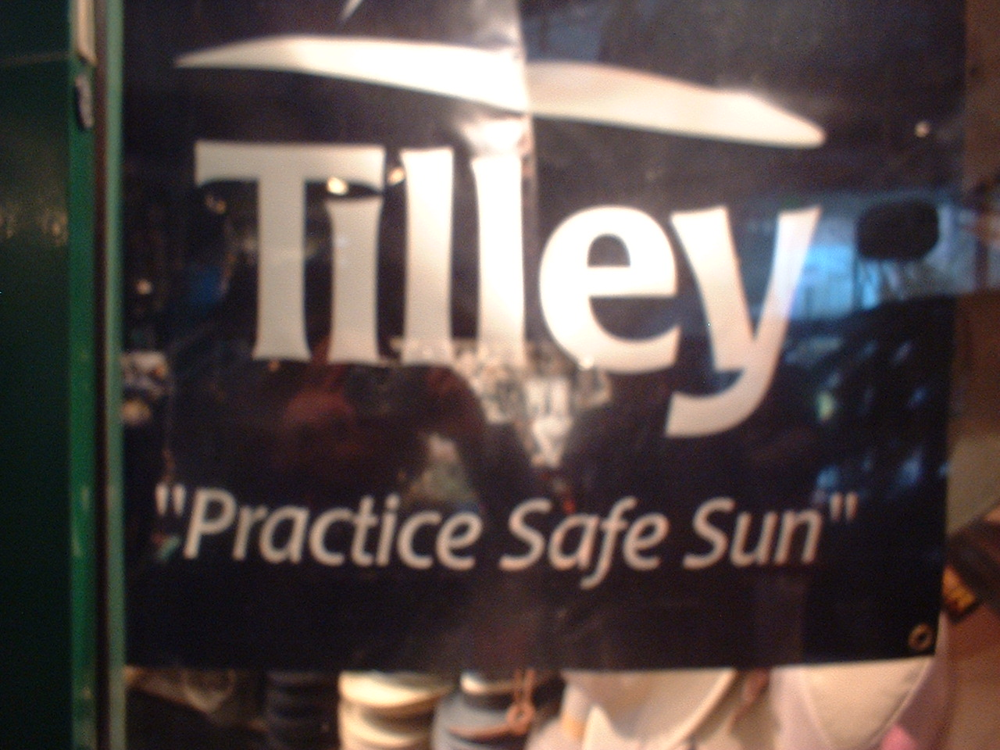

Practice Safe Sun  
Corporation: Hats in the Belfrey  
Product: Hats  
Location: Baltimore, MD  
Collected On: 04-09-2006  
Researcher: M. Cleland
 
*Please suggest how one might go about performing this command as literally as possible.*

1. Have a crane shade you from the sun by suspending a safe over your head daily... until the day you really need to.
2. On sunny days wear a huge condom over your entire body

