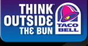

Think Outside The Bun.  
Corporation: Taco Bell  
Product: fast food  
Collected On: 02-18-2005  
Researcher: escha  
Language: english
 
*Please suggest how one might go about performing this command as literally as possible.*

1. Take head out of ass, then think.
2. Get out of the bun. Think about what you've done
3. When eating burgers, cease all thought processes.

