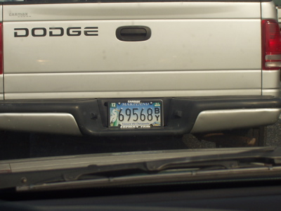

Treasure the Chesapeake  
Corporation: State of MD  
Product: License Plate  
Location: Baltimore, MD     
Collected On: 04-09-2006  
Researcher: S. Shade
 
*Please suggest how one might go about performing this command as literally as possible.*

1. make lots of shrines
2. Dump gold and priceless items into the chesapeake

